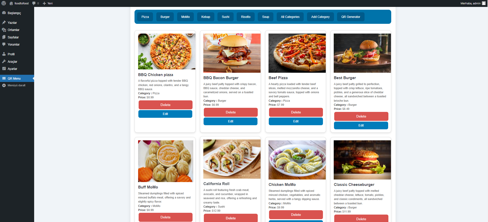
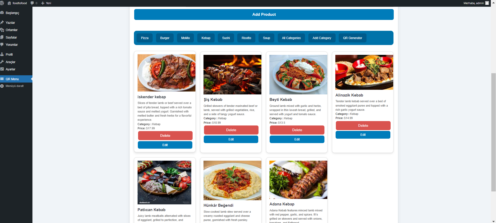
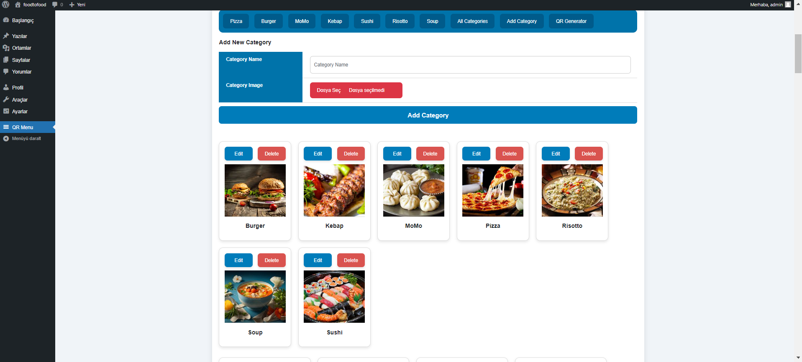
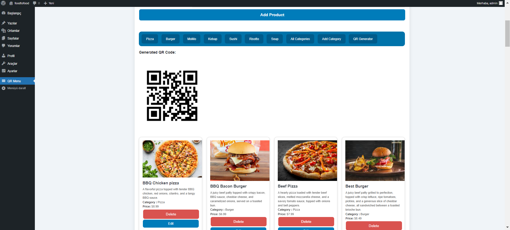
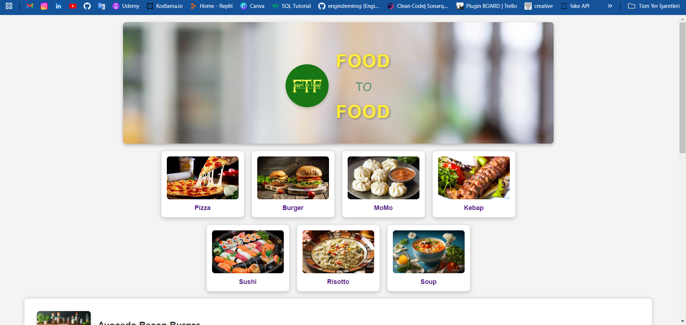
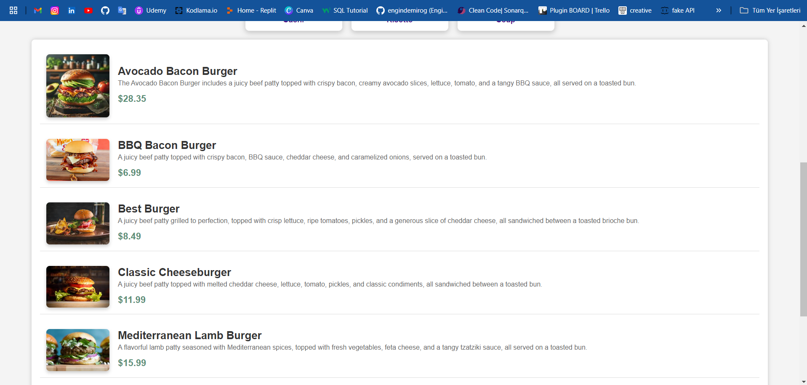

# 📱 QR-Menu WordPress Eklentisi

**QR-Menu**, WordPress tabanlı restoranlar için geliştirilmiş, kullanıcı dostu ve dinamik bir dijital menü eklentisidir. Yöneticiler bu eklenti sayesinde ürünleri tanımlayabilir, kategorilere ayırabilir ve her menüye özel QR kod oluşturarak müşterilere hızlı erişim sağlayabilir.

---

## 🔧 Kullanılan Teknolojiler

- **PHP** – WordPress eklenti geliştirme
- **HTML** – Yapısal içerik oluşturma
- **CSS** – Arayüz tasarımı
- **JavaScript** *(isteğe bağlı)* – Etkileşimli özellikler
- **WordPress Plugin API** – Eklenti altyapısı

---

## 🚀 Temel Özellikler

### ✅ Ürün Tanımlama

Yönetici panelinden kolayca:

- Ürün adı girilebilir  
- Açıklama yazılabilir  
- Fiyat tanımlanabilir  
- Kategori Eklenebilir 
- Kategori seçilebilir 

- Ürüne görsel eklenebilir

---

### 📋 Ürün Listeleme

Tüm ürünler tek bir ekran üzerinde listelenir. Ürünler burada düzenlenebilir veya silinebilir.

---

### 🗂️ Kategoriye Göre Filtreleme

Kategori barı ile ürünler filtrelenebilir, kullanıcıya daha düzenli bir görünüm sunulur.

---

### ➕ Kategori Ekleme

Yeni kategoriler kolaylıkla tanımlanabilir ve ürünlere atanabilir.

---

### 🔄 QR Kod Oluşturma

Her oluşturulan menü için otomatik QR kod üretimi yapılır. Bu sayede müşteriler, cep telefonlarıyla menüye hızlıca erişebilir.

---

### 🍽️ Statik Menü Örneği

Demo olarak hazırlanmış örnek bir restoran menüsü görünümü:

Kategorili menü yapısı:

---

## 📦 Kurulum Adımları

1. Proje klasörünü `wp-content/plugins/` dizinine yükleyin.
2. WordPress yönetici paneline giriş yapın.
3. “Eklentiler” sekmesinden **QR-Menu** eklentisini aktif hale getirin.
4. Yönetim panelinden ürün ve kategori tanımlamalarını yaparak kullanmaya başlayın.

---

## 📌 Notlar

- Geliştirme ortamı: **WordPress 6.x**, **PHP 8.x**
- Eklenti mobil uyumlu, sade ve işlevsel arayüze sahiptir.
- Proje tamamlanmıştır ve dağıtıma hazırdır.

---

## 📬 İletişim

Proje hakkında geri bildirim veya destek için bizimle iletişime geçebilirsiniz.

> Bu eklenti, restoranlar için dijital dönüşüm sürecinde QR kod destekli modern menü çözümleri sunmak amacıyla geliştirilmiştir.
